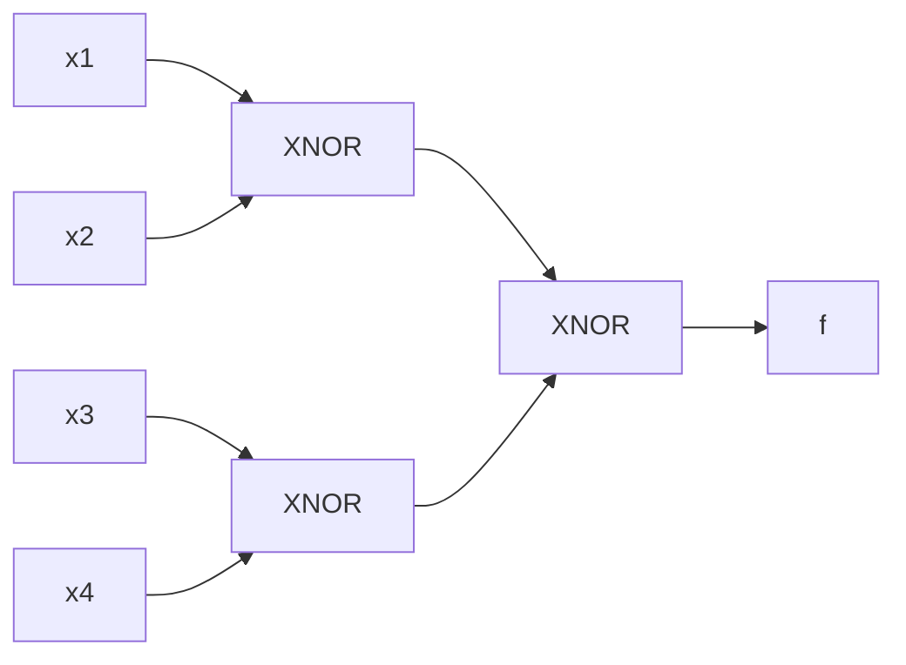
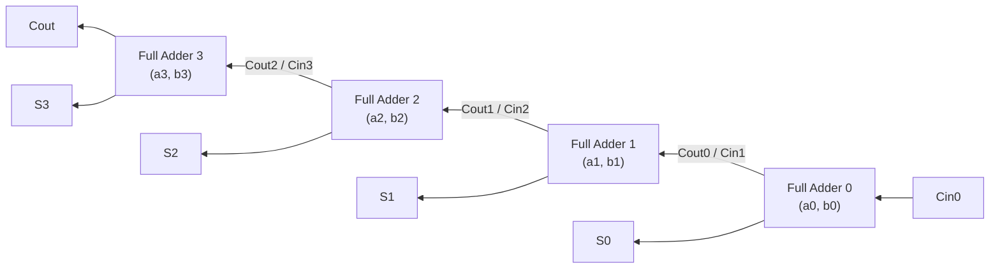

# Pontificia Universidad Javeriana
## Departamento de Electrónica
### System on Chip (SoC)

---

# Taller de Diseño: Gate-Level y RTL-Multiplexores

> **Instrucción General:**  
> Para cada ejercicio, desarrolle códigos y simulaciones en **VHDL** y en **Verilog**.  
> Para cada uno de los ejercicios de diseño se deberá presentar:
> 1. El código en VHDL y en Verilog utilizado (circuito y testbench).
> 2. El circuito generado por Quartus (RTL Viewer).
> 3. Resultado de las simulaciones resaltando los eventos de interés en el diagrama de tiempos con su respectiva explicación de tal forma que le permita sacar conclusiones al respecto del funcionamiento de los módulos desarrollados.

---

## Ejercicio Número 1: Circuito greater-than – Gate-level

Un circuito *greater-than* compara dos entradas, $a$ y $b$, e indica a la salida un `'1'` cuando $a$ es mayor que $b$. En este ejercicio se busca generar el código en HDL para un circuito *greater-than* para entradas de **4 bits**, diseñado a nivel compuerta (*gate-level*).

1. Diseñe la tabla de verdad para un circuito *greater-than* para entradas de 2 bits. Derive una expresión como suma de productos (SOP) que describa la función lógica para este circuito.
2. Escriba un testbench para verificar el circuito *greater-than* de 2 bits. Simule y verifique en ModelSim.
3. Utilice una combinación de un circuito *greater-than* de 2 bits y circuitos `twoBitEquality` junto con la lógica necesaria para describir una arquitectura estructural de un circuito *greater-than* para entradas de 4 bits. Diseñe primero un diagrama de bloques y derive el código VHDL de él.
4. Escriba un testbench para verificar el circuito *greater-than* de 4 bits. Simule y verifique en ModelSim.

---

## Ejercicio Número 2: Binary Decoder – Gate Level

Un decodificador binario $n$-to-$2^n$ pone en `'1'` solamente uno de los $2^n$ bits de acuerdo con la combinación de bits de la entrada. La tabla de verdad de un decodificador binario 2-to-4 se muestra a continuación:

| `en` | `in(1)` | `in(0)` | `bcode` (`output`) |
| :---: | :---: | :---: | :---: |
| 0 | - | - | 0000 |
| 1 | 0 | 0 | 0001 |
| 1 | 0 | 1 | 0010 |
| 1 | 1 | 0 | 0100 |
| 1 | 1 | 1 | 1000 |

1. De la tabla de verdad anterior, derive una expresión como suma de productos que describa la función lógica para un *2-to-4 binary decoder*.
2. Escriba un testbench para verificar el circuito decodificador. Simule y verifique en ModelSim.
3. Utilice el circuito *2-to-4 binary decoder* para derivar un decodificador **3-to-8**. Diseñe un diagrama en bloques y derive de él el código en VHDL.
4. Escriba un testbench para verificar el circuito *3-to-8 binary decoder*. Simule y verifique en ModelSim.
5. Utilice el circuito *2-to-4 binary decoder* para derivar un decodificador **4-to-16**. Diseñe un diagrama en bloques y derive de él el código en VHDL.
6. Escriba un testbench para verificar el circuito *4-to-16 binary decoder*. Simule y verifique en ModelSim.

---

## Ejercicio Número 3: Diseño lógico basado en Multiplexores

1. Implemente la función lógica de la **Figura 1** utilizando un circuito que incluya un multiplexor.
2. En un solo proyecto de Quartus, incluya el circuito basado en multiplexores, y un módulo que implemente la función lógica de la Figura 1 a nivel compuerta.
3. Diseñe un testbench para verificar el funcionamiento del circuito generado. Diseñe suficientes vectores de prueba para permitir una verificación comprensiva de varios casos. Simule su testbench en ModelSim. Compare los resultados entre los dos módulos.
4. Como conclusiones, describa la simulación obtenida, haciendo notar aquellos intervalos de interés donde es posible verificar el funcionamiento correcto del circuito.

*Figura 1. Función lógica para ser implementada con multiplexores.*

---

## Ejercicio Número 4: Aritmética básica binaria basada en Multiplexores

1. Diseñe un circuito sumador de un bit tipo *Full Adder*, y codifíquelo en VHDL utilizando **lógica basada en multiplexores** en vez de lógica a nivel compuerta como tradicionalmente se implementa el circuito.

#### Tabla de Verdad: Full Adder (Figura 2)
| A | B | $C_{in}$ | SUM ($S$) | $C_{out}$ |
| :-: | :-: | :------: | :-------: | :-------: |
| 0 | 0 | 0 | 0 | 0 |
| 0 | 0 | 1 | 1 | 0 |
| 0 | 1 | 0 | 1 | 0 |
| 0 | 1 | 1 | 0 | 1 |
| 1 | 0 | 0 | 1 | 0 |
| 1 | 0 | 1 | 0 | 1 |
| 1 | 1 | 0 | 0 | 1 |
| 1 | 1 | 1 | 1 | 1 |

2. Diseñe un sumador de **4 bits**, integrando cuatro circuitos *Full Adder* (Ripple Carry Adder) como se observa en la **Figura 3**, y codifíquelo en HDL.

*Figura 3. Circuito sumador de 4 bits.*

3. Diseñe un módulo testbench para verificar el funcionamiento de su circuito sumador de 4 bits. Diseñe al menos **10 vectores de prueba** que cubran todas las condiciones de operación del circuito (como por ejemplo sumas dentro del rango de 4 bits y **OVERFLOW**).
