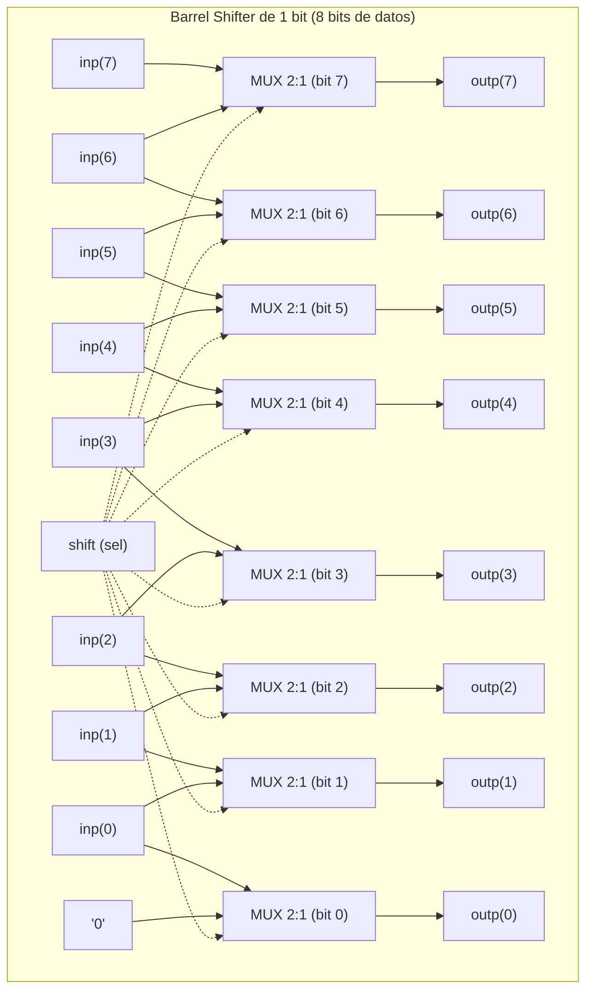
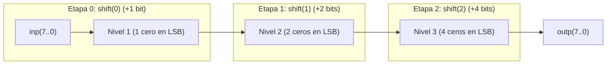
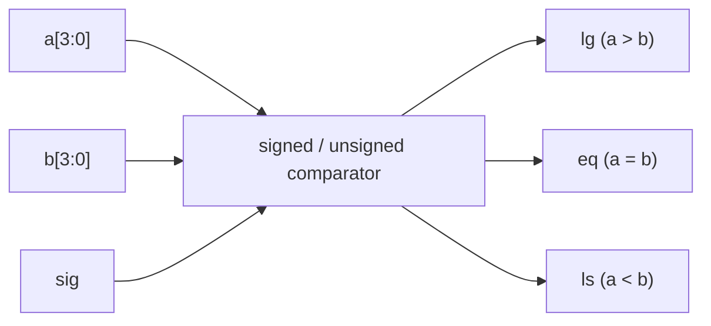

# Pontificia Universidad Javeriana
## Departamento de Electrónica
### System on Chip (SoC)

---

# Taller de Diseño de Circuitos Combinacionales a nivel RTL

> **Instrucción General:**  
> Para cada uno de los ejercicios de diseño siguientes se deberá presentar:
> 1. El código en **VHDL** y en **Verilog** utilizado (circuito y testbench).
> 2. El circuito generado por Quartus (**RTL Viewer**).
> 3. Resultado de las simulaciones resaltando los eventos de interés en el **diagrama de tiempos** con su respectiva explicación de tal forma que le permita sacar conclusiones al respecto del funcionamiento de los módulos desarrollados.

---

## Ejercicio Número 1: Encoders – Decoders (Código Gray)

El código Gray (*Gray code*) es un esquema de codificación en el cual, para dos números binarios consecutivos su codificación cambia solamente en un solo bit. De esta manera, toda secuencia con la propiedad de cambiar solamente un bit entre dos números consecutivos será llamada "Gray Code". Cada número en una secuencia Gray Code difiere de su predecesor solamente en un bit.

La codificación Gray tiene aplicaciones en varios campos de ingeniería tales como sistemas de adquisición, comunicaciones, posicionamiento mecánico de sensores, etc.

La tabla de verdad de la **Figura 1** corresponde a una codificación BCD-to-GrayCode (Binario a Gray) de 4 bits:

### Tabla de Verdad: Codificador Binario a Gray de 4 Bits (Figura 1)

| Decimal | Binary code ($B_3 B_2 B_1 B_0$) | Gray code ($G_3 G_2 G_1 G_0$) |
| :---: | :---: | :---: |
| **0**  | 0000 | 0000 |
| **1**  | 0001 | 0001 |
| **2**  | 0010 | 0011 |
| **3**  | 0011 | 0010 |
| **4**  | 0100 | 0110 |
| **5**  | 0101 | 0111 |
| **6**  | 0110 | 0101 |
| **7**  | 0111 | 0100 |
| **8**  | 1000 | 1100 |
| **9**  | 1001 | 1101 |
| **10** | 1010 | 1111 |
| **11** | 1011 | 1110 |
| **12** | 1100 | 1010 |
| **13** | 1101 | 1011 |
| **14** | 1110 | 1001 |
| **15** | 1111 | 1000 |

*Figura 1. Codificador Gray.*

### Requerimientos:
a. Investigue dos aplicaciones para un encoder Gray Code.  
b. Determine las ecuaciones lógicas que describen la tabla de verdad observada en la Figura 1.  
c. Escriba en HDL el código para un encoder Gray Code utilizando cualquiera de las sentencias aprendidas (`when/else`, `with/select/when` o `process`).  
d. Verifique mediante un testbench el circuito generado.

---

## Ejercicio Número 2: Barrel Shifter

Un circuito *Barrel Shifter* corresponde a un módulo que desplaza la entrada un cierto número de bits, añadiendo ceros en los bits que son desplazados. A diferencia de un registro de desplazamiento el cual es un circuito secuencial (y será estudiado más adelante en el curso), un Barrel Shifter corresponde a un **circuito combinacional**.

---

### 2.1. Barrel Shifter de 1 Bit de Desplazamiento

La **Figura 2** muestra el diagrama de un circuito barrel shifter de 1 bit de desplazamiento. En este caso, el circuito debe desplazar el vector de entrada (de tamaño 8 bits) 0 o 1 posición a la izquierda.
- Cuando se realiza el desplazamiento (`shift = '1'`), el bit LSB debe llenarse con `'0'` (se muestra en la esquina inferior izquierda del esquemático).
- Si la señal `shift = '0'`, entonces $\text{outp} = \text{inp}$.
- De lo contrario, si `shift = '1'`, entonces $\text{outp}(0) = \text{'0'}$ y $\text{outp}(i) = \text{inp}(i-1)$, para $1 \le i \le 7$.

Escriba un código concurrente para este circuito. Verifique mediante un testbench el circuito generado.

*Figura 2. Circuito barrel shifter de 1 bit de desplazamiento.*

---

### 2.2. Barrel Shifter Multietapa de 0 a 7 Bits (8 Bits de Datos)

La **Figura 3** muestra el diagrama de un circuito barrel shifter. La entrada es un vector de 8 bits. La salida es una versión desplazada de la entrada, con la cantidad de desplazamiento definida por la entrada `shift` (de 0 a 7, vector de 3 bits `shift(2 downto 0)`).

El circuito consta de **tres barrel shifters individuales** en cascada, cada uno similar al desarrollado en el punto anterior:
- El primer barrel shifter desplaza 1 posición (controlado por `shift(0)`) y tiene solo un `'0'` conectado a uno de los multiplexores (esquina inferior izquierda).
- El segundo desplaza 2 posiciones (controlado por `shift(1)`) y tiene dos ceros conectados en las posiciones inferiores.
- El tercero desplaza 4 posiciones (controlado por `shift(2)`) y tiene cuatro ceros conectados en las posiciones inferiores.
- *(Para vectores más grandes, simplemente seguiríamos duplicando el número de entradas '0').*

**Comportamiento según la señal de control:**
- Si `shift = "001"`, solo el primer nivel de desplazamiento genera un cambio en la entrada (desplaza 1 bit).
- Si `shift = "111"`, todos los módulos causan un cambio en la entrada (desplaza $1 + 2 + 4 = 7$ bits).

Escriba un código concurrente para este circuito. Verifique mediante un testbench el funcionamiento del circuito generado. Genere los vectores de prueba que permitan realizar todos los casos de desplazamiento (de 0 a 7).

*Figura 3. Barrel Shifter de 8 bits con desplazamiento programable de 0 a 7 posiciones.*

---

## Ejercicio Número 3: Comparador Signed - Unsigned

El circuito `nBitcomparator` discutido en clase presenta la posibilidad de comparar dos números de entrada de tipo `STD_LOGIC_VECTOR`, interpretados como enteros sin signo.

Diseñe un circuito combinacional en VHDL que extienda la funcionalidad del circuito a **enteros con signo en complemento a 2**.

### Especificaciones:
- **Entradas:**
  - `a[3:0]`: Primer operando binario (4 bits).
  - `b[3:0]`: Segundo operando binario (4 bits).
  - `sig`: Señal de control de modo:
    - $\text{sig} = \text{'1'} \implies$ Los operandos se interpretan como **enteros con signo** (complemento a 2, rango $-8$ a $+7$).
    - $\text{sig} = \text{'0'} \implies$ Los operandos se interpretan como **enteros sin signo** (rango $0$ a $15$).
- **Salidas:**
  - `lg`: Nivel alto `'1'` si $a > b$ (*larger / greater*).
  - `eq`: Nivel alto `'1'` si $a = b$ (*equal*).
  - `ls`: Nivel alto `'1'` si $a < b$ (*less*).
- **Arquitectura:**
  - Utilice una **arquitectura paralela** en donde todos los casos de comparación son evaluados concurrentemente.
  - Las salidas estarán determinadas por selectores priorizados y la señal `sig`.

*Figura 4. Entidad superior de un circuito comparador signed/unsigned.*
