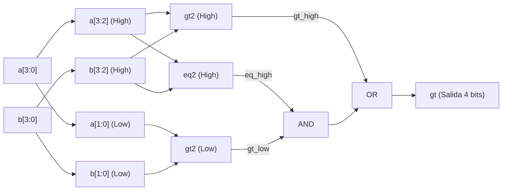

# Taller de Diseño: Gate-Level y RTL-Multiplexores
**Pontificia Universidad Javeriana**  
**Departamento de Electrónica**  
**System on Chip (SoC)**  

---

## Ejercicio Número 1: Circuito Greater-Than – Gate-Level

Un circuito *greater-than* compara dos entradas binarias, $a$ y $b$, e indica en su salida un `'1'` lógico únicamente cuando el valor numérico representado por $a$ es estrictamente mayor que $b$ ($a > b$).

---

### 1.1. Circuito Greater-Than de 2 Bits

#### 1.1.1. Tabla de Verdad
Sean las entradas $a = (a_1, a_0)$ y $b = (b_1, b_0)$, representando números sin signo en el rango de $0$ a $3$. La salida es $gt \in \{0, 1\}$.

| Fila | $a_1$ | $a_0$ | $b_1$ | $b_0$ | Decimal $a$ | Decimal $b$ | Condición ($a > b$) | Salida ($gt$) | Minitérmino |
| :---: | :---: | :---: | :---: | :---: | :---: | :---: | :---: | :---: | :---: |
| **0**  | 0 | 0 | 0 | 0 | 0 | 0 | $0 > 0$ (Falso) | **0** | - |
| **1**  | 0 | 0 | 0 | 1 | 0 | 1 | $0 > 1$ (Falso) | **0** | - |
| **2**  | 0 | 0 | 1 | 0 | 0 | 2 | $0 > 2$ (Falso) | **0** | - |
| **3**  | 0 | 0 | 1 | 1 | 0 | 3 | $0 > 3$ (Falso) | **0** | - |
| **4**  | 0 | 1 | 0 | 0 | 1 | 0 | $1 > 0$ (**Verdadero**) | **1** | $m_4 = \overline{a_1} a_0 \overline{b_1} \overline{b_0}$ |
| **5**  | 0 | 1 | 0 | 1 | 1 | 1 | $1 > 1$ (Falso) | **0** | - |
| **6**  | 0 | 1 | 1 | 0 | 1 | 2 | $1 > 2$ (Falso) | **0** | - |
| **7**  | 0 | 1 | 1 | 1 | 1 | 3 | $1 > 3$ (Falso) | **0** | - |
| **8**  | 1 | 0 | 0 | 0 | 2 | 0 | $2 > 0$ (**Verdadero**) | **1** | $m_8 = a_1 \overline{a_0} \overline{b_1} \overline{b_0}$ |
| **9**  | 1 | 0 | 0 | 1 | 2 | 1 | $2 > 1$ (**Verdadero**) | **1** | $m_9 = a_1 \overline{a_0} \overline{b_1} b_0$ |
| **10** | 1 | 0 | 1 | 0 | 2 | 2 | $2 > 2$ (Falso) | **0** | - |
| **11** | 1 | 0 | 1 | 1 | 2 | 3 | $2 > 3$ (Falso) | **0** | - |
| **12** | 1 | 1 | 0 | 0 | 3 | 0 | $3 > 0$ (**Verdadero**) | **1** | $m_{12} = a_1 a_0 \overline{b_1} \overline{b_0}$ |
| **13** | 1 | 1 | 0 | 1 | 3 | 1 | $3 > 1$ (**Verdadero**) | **1** | $m_{13} = a_1 a_0 \overline{b_1} b_0$ |
| **14** | 1 | 1 | 1 | 0 | 3 | 2 | $3 > 2$ (**Verdadero**) | **1** | $m_{14} = a_1 a_0 b_1 \overline{b_0}$ |
| **15** | 1 | 1 | 1 | 1 | 3 | 3 | $3 > 3$ (Falso) | **0** | - |

---

#### 1.1.2. Derivación de la Expresión en Suma de Productos (SOP)

La función canónica corresponde a la suma de los 6 minitérminos donde la salida es 1:
$$\text{gt}(a_1, a_0, b_1, b_0) = \sum m(4, 8, 9, 12, 13, 14)$$

**Mapa de Karnaugh:**

| $a_1 a_0 \backslash b_1 b_0$ | **00** | **01** | **11** | **10** |
| :---: | :---: | :---: | :---: | :---: |
| **00** | 0 | 0 | 0 | 0 |
| **01** | **1** ($m_4$) | 0 | 0 | 0 |
| **11** | **1** ($m_{12}$) | **1** ($m_{13}$) | 0 | **1** ($m_{14}$) |
| **10** | **1** ($m_8$) | **1** ($m_9$) | 0 | 0 |

**Agrupamiento de términos primos esenciales:**
1. **Grupo 1 (4 celdas):** Celdas $\{m_8, m_9, m_{12}, m_{13}\} \implies a_1 \overline{b_1}$ *(El bit más significativo de $a$ es 1 y el de $b$ es 0)*.
2. **Grupo 2 (2 celdas):** Celdas $\{m_4, m_{12}\} \implies a_0 \overline{b_1} \overline{b_0}$ *(El bit menos significativo de $a$ es 1 y ambos bits de $b$ son 0)*.
3. **Grupo 3 (2 celdas):** Celdas $\{m_{12}, m_{14}\} \implies a_1 a_0 \overline{b_0}$ *($a$ es '11' y el bit menos significativo de $b$ es 0)*.

**Expresión Booleana Mínima (SOP):**
$$\mathbf{gt = (a_1 \cdot \overline{b_1}) + (a_1 \cdot a_0 \cdot \overline{b_0}) + (a_0 \cdot \overline{b_1} \cdot \overline{b_0})}$$

---

#### 1.1.3. Códigos HDL y Testbenches

##### Código VHDL (`gt2.vhd`)
```vhdl
library IEEE;
use IEEE.STD_LOGIC_1164.ALL;

entity gt2 is
    port (
        a  : in  std_logic_vector(1 downto 0);
        b  : in  std_logic_vector(1 downto 0);
        gt : out std_logic
    );
end entity gt2;

architecture Behavioral of gt2 is
begin
    gt <= (a(1) and not b(1)) or
          (a(1) and a(0) and not b(0)) or
          (a(0) and not b(1) and not b(0));
end architecture Behavioral;
```

##### Testbench VHDL (`gt2_tb.vhd`)
```vhdl
library IEEE;
use IEEE.STD_LOGIC_1164.ALL;
use IEEE.NUMERIC_STD.ALL;

entity gt2_tb is
end entity gt2_tb;

architecture Behavioral of gt2_tb is
    component gt2 is
        port (
            a  : in  std_logic_vector(1 downto 0);
            b  : in  std_logic_vector(1 downto 0);
            gt : out std_logic
        );
    end component;

    signal a_tb  : std_logic_vector(1 downto 0) := "00";
    signal b_tb  : std_logic_vector(1 downto 0) := "00";
    signal gt_tb : std_logic;

    constant T_STEP : time := 20 ns;
begin
    DUT: gt2
        port map (
            a  => a_tb,
            b  => b_tb,
            gt => gt_tb
        );

    stim_proc: process
    begin
        for i in 0 to 3 loop
            for j in 0 to 3 loop
                a_tb <= std_logic_vector(to_unsigned(i, 2));
                b_tb <= std_logic_vector(to_unsigned(j, 2));
                wait for T_STEP;
                
                if i > j then
                    assert gt_tb = '1'
                        report "ERROR: Esperaba gt=1 para a=" & integer'image(i) & ", b=" & integer'image(j)
                        severity error;
                else
                    assert gt_tb = '0'
                        report "ERROR: Esperaba gt=0 para a=" & integer'image(i) & ", b=" & integer'image(j)
                        severity error;
                end if;
            end loop;
        end loop;
        wait;
    end process;
end architecture Behavioral;
```

##### Código Verilog (`gt2.v`)
```verilog
module gt2 (
    input  wire [1:0] a,
    input  wire [1:0] b,
    output wire       gt
);

    assign gt = (a[1] & ~b[1]) |
                (a[1] & a[0] & ~b[0]) |
                (a[0] & ~b[1] & ~b[0]);

endmodule
```

##### Testbench Verilog (`gt2_tb.v`)
```verilog
`timescale 1ns / 1ps

module gt2_tb;
    reg  [1:0] a;
    reg  [1:0] b;
    wire       gt;

    integer i, j;

    gt2 dut (
        .a(a),
        .b(b),
        .gt(gt)
    );

    initial begin
        a = 2'b00;
        b = 2'b00;

        for (i = 0; i < 4; i = i + 1) begin
            for (j = 0; j < 4; j = j + 1) begin
                a = i;
                b = j;
                #20;
                if ((i > j && gt !== 1'b1) || (i <= j && gt !== 1'b0)) begin
                    $display("ERROR en a=%0d, b=%0d => gt=%b", i, j, gt);
                end
            end
        end
        $stop;
    end
endmodule
```

---

#### 1.1.4. Circuito Generado por Quartus (RTL Viewer)

> **[EVIDENCIA FOTOGRÁFICA 1: RTL VIEWER GT2]**  
> *Guarda la captura de Quartus (Tools $\rightarrow$ Netlist Viewers $\rightarrow$ RTL Viewer) con el nombre `reports/images/gt2_rtl.png`.*


---

#### 1.1.5. Simulación en ModelSim y Análisis de Resultados

> **[EVIDENCIA FOTOGRÁFICA 2: SIMULACIÓN MODELSIM GT2]**  
> *Guarda la captura de la forma de onda de ModelSim con el nombre `reports/images/gt2_modelsim.png`.*


##### Análisis del Diagrama de Tiempos:
1. La simulación recorre un total de **16 combinaciones** (de $a=0, b=0$ hasta $a=3, b=3$), asignando $20\,\text{ns}$ a cada vector de prueba (tiempo total: $320\,\text{ns}$).
2. **Eventos de Interés ($gt = 1$):**
   * En el intervalo correspondiente a $a=1$, la salida $gt$ se activa en `'1'` durante $b=0$.
   * En el intervalo de $a=2$, la salida $gt$ se activa en `'1'` durante $b=0$ y $b=1$.
   * En el intervalo de $a=3$, la salida $gt$ se activa en `'1'` durante $b=0$, $b=1$ y $b=2$.
3. **Casos $gt = 0$:**
   * En todas las combinaciones donde $a = b$ o $a < b$, la salida se mantiene de forma estable en nivel bajo `'0'`.
4. **Conclusión:** El comportamiento observado en la simulación temporal coincide exactamente con la tabla de verdad y la ecuación SOP simplificada.

---

### 1.2. Circuito Comparador de Igualdad de 2 Bits (`twoBitEquality` / `eq2`)

El módulo `twoBitEquality` compara dos vectores binarios de 2 bits, $a = (a_1, a_0)$ y $b = (b_1, b_0)$, y genera un `'1'` lógico en su salida `eq` únicamente cuando ambas entradas son exactamente idénticas ($a = b$). Este módulo sirve como bloque elemental para la construcción estructural del comparador de 4 bits.

---

#### 1.2.1. Tabla de Verdad
Sean las entradas $a = (a_1, a_0)$ y $b = (b_1, b_0)$ con $a, b \in \{0, 1, 2, 3\}$. La salida es $eq \in \{0, 1\}$.

| Fila | $a_1$ | $a_0$ | $b_1$ | $b_0$ | Decimal $a$ | Decimal $b$ | Condición ($a = b$) | Salida ($eq$) | Minitérmino |
| :---: | :---: | :---: | :---: | :---: | :---: | :---: | :---: | :---: | :---: |
| **0**  | 0 | 0 | 0 | 0 | 0 | 0 | $0 = 0$ (**Verdadero**) | **1** | $m_0 = \overline{a_1} \overline{a_0} \overline{b_1} \overline{b_0}$ |
| **1**  | 0 | 0 | 0 | 1 | 0 | 1 | $0 = 1$ (Falso) | **0** | - |
| **2**  | 0 | 0 | 1 | 0 | 0 | 2 | $0 = 2$ (Falso) | **0** | - |
| **3**  | 0 | 0 | 1 | 1 | 0 | 3 | $0 = 3$ (Falso) | **0** | - |
| **4**  | 0 | 1 | 0 | 0 | 1 | 0 | $1 = 0$ (Falso) | **0** | - |
| **5**  | 0 | 1 | 0 | 1 | 1 | 1 | $1 = 1$ (**Verdadero**) | **1** | $m_5 = \overline{a_1} a_0 \overline{b_1} b_0$ |
| **6**  | 0 | 1 | 1 | 0 | 1 | 2 | $1 = 2$ (Falso) | **0** | - |
| **7**  | 0 | 1 | 1 | 1 | 1 | 3 | $1 = 3$ (Falso) | **0** | - |
| **8**  | 1 | 0 | 0 | 0 | 2 | 0 | $2 = 0$ (Falso) | **0** | - |
| **9**  | 1 | 0 | 0 | 1 | 2 | 1 | $2 = 1$ (Falso) | **0** | - |
| **10** | 1 | 0 | 1 | 0 | 2 | 2 | $2 = 2$ (**Verdadero**) | **1** | $m_{10} = a_1 \overline{a_0} b_1 \overline{b_0}$ |
| **11** | 1 | 0 | 1 | 1 | 2 | 3 | $2 = 3$ (Falso) | **0** | - |
| **12** | 1 | 1 | 0 | 0 | 3 | 0 | $3 = 0$ (Falso) | **0** | - |
| **13** | 1 | 1 | 0 | 1 | 3 | 1 | $3 = 1$ (Falso) | **0** | - |
| **14** | 1 | 1 | 1 | 0 | 3 | 2 | $3 = 2$ (Falso) | **0** | - |
| **15** | 1 | 1 | 1 | 1 | 3 | 3 | $3 = 3$ (**Verdadero**) | **1** | $m_{15} = a_1 a_0 b_1 b_0$ |

---

#### 1.2.2. Derivación Lógica a Nivel Compuerta

Para que dos palabras binarias de 2 bits sean iguales, se debe cumplir simultáneamente que el bit más significativo sea igual ($a_1 = b_1$) **Y** que el bit menos significativo sea igual ($a_0 = b_0$).

La igualdad a nivel de bit se implementa con la compuerta lógica **XNOR** (equivalencia):
* $e_1 = a_1 \odot b_1 = a_1 b_1 + \overline{a_1}\overline{b_1}$
* $e_0 = a_0 \odot b_0 = a_0 b_0 + \overline{a_0}\overline{b_0}$

Por lo tanto, la función lógica a nivel compuerta es:
$$\mathbf{eq = (a_1 \odot b_1) \cdot (a_0 \odot b_0) = (a_1 \text{ XNOR } b_1) \text{ AND } (a_0 \text{ XNOR } b_0)}$$

---

#### 1.2.3. Códigos HDL y Testbenches

##### Código VHDL (`eq2.vhd`)
```vhdl
library IEEE;
use IEEE.STD_LOGIC_1164.ALL;

entity eq2 is
    port (
        a  : in  std_logic_vector(1 downto 0);
        b  : in  std_logic_vector(1 downto 0);
        eq : out std_logic
    );
end entity eq2;

architecture Behavioral of eq2 is
begin
    -- Igualdad a nivel compuerta: (a1 XNOR b1) AND (a0 XNOR b0)
    eq <= (a(1) xnor b(1)) and (a(0) xnor b(0));
end architecture Behavioral;
```

##### Testbench VHDL (`eq2_tb.vhd`)
```vhdl
library IEEE;
use IEEE.STD_LOGIC_1164.ALL;
use IEEE.NUMERIC_STD.ALL;

entity eq2_tb is
end entity eq2_tb;

architecture Behavioral of eq2_tb is
    component eq2 is
        port (
            a  : in  std_logic_vector(1 downto 0);
            b  : in  std_logic_vector(1 downto 0);
            eq : out std_logic
        );
    end component;

    signal a_tb  : std_logic_vector(1 downto 0) := "00";
    signal b_tb  : std_logic_vector(1 downto 0) := "00";
    signal eq_tb : std_logic;

    constant T_STEP : time := 20 ns;
begin
    DUT: eq2
        port map (
            a  => a_tb,
            b  => b_tb,
            eq => eq_tb
        );

    stim_proc: process
    begin
        for i in 0 to 3 loop
            for j in 0 to 3 loop
                a_tb <= std_logic_vector(to_unsigned(i, 2));
                b_tb <= std_logic_vector(to_unsigned(j, 2));
                wait for T_STEP;
                
                if i = j then
                    assert eq_tb = '1'
                        report "ERROR: Esperaba eq=1 para a=" & integer'image(i) & ", b=" & integer'image(j)
                        severity error;
                else
                    assert eq_tb = '0'
                        report "ERROR: Esperaba eq=0 para a=" & integer'image(i) & ", b=" & integer'image(j)
                        severity error;
                end if;
            end loop;
        end loop;
        
        report "Simulacion de eq2_tb completada exitosamente." severity note;
        wait;
    end process;
end architecture Behavioral;
```

##### Código Verilog (`eq2.v`)
```verilog
`timescale 1ns / 1ps

module eq2 (
    input  wire [1:0] a,
    input  wire [1:0] b,
    output wire       eq
);

    // Igualdad a nivel compuerta: (a1 ~^ b1) & (a0 ~^ b0)
    assign eq = (a[1] ~^ b[1]) & (a[0] ~^ b[0]);

endmodule
```

##### Testbench Verilog (`eq2_tb.v`)
```verilog
`timescale 1ns / 1ps

module eq2_tb;
    reg  [1:0] a;
    reg  [1:0] b;
    wire       eq;

    integer i, j;
    integer errors = 0;

    eq2 dut (
        .a(a),
        .b(b),
        .eq(eq)
    );

    initial begin
        a = 2'b00;
        b = 2'b00;

        for (i = 0; i < 4; i = i + 1) begin
            for (j = 0; j < 4; j = j + 1) begin
                a = i;
                b = j;
                #20;
                if (i == j && eq !== 1'b1) begin
                    $display("ERROR: Esperaba eq=1 para a=%0d, b=%0d => obtenido eq=%b", i, j, eq);
                    errors = errors + 1;
                end else if (i != j && eq !== 1'b0) begin
                    $display("ERROR: Esperaba eq=0 para a=%0d, b=%0d => obtenido eq=%b", i, j, eq);
                    errors = errors + 1;
                end
            end
        end

        if (errors == 0) begin
            $display(">>> Simulacion de eq2_tb exitosa: 0 errores encontrados. <<<");
        end else begin
            $display(">>> Simulacion con %0d errores. <<<", errors);
        end

        $stop;
    end
endmodule
```

---

#### 1.2.4. Circuito Generado por Quartus (RTL Viewer)

> **[EVIDENCIA FOTOGRÁFICA 3: RTL VIEWER EQ2]**  
> *Guarda la captura de Quartus (Tools $\rightarrow$ Netlist Viewers $\rightarrow$ RTL Viewer) con el nombre `reports/images/eq2_rtl.png`.*


---

#### 1.2.5. Simulación en ModelSim y Análisis de Resultados

> **[EVIDENCIA FOTOGRÁFICA 4: SIMULACIÓN MODELSIM EQ2]**  
> *Guarda la captura de la forma de onda de ModelSim con el nombre `reports/images/eq2_modelsim.png`.*


##### Análisis del Diagrama de Tiempos:
1. **Duración del Ensayo:** Se evaluaron las 16 combinaciones de entrada aplicando $20\,\text{ns}$ a cada vector, para un tiempo total de simulación de $320\,\text{ns}$.
2. **Eventos de Interés ($eq = 1$):** La salida se activa en nivel lógico alto únicamente en los 4 instantes donde el valor numérico de $a$ coincide con $b$:
   - $t \in [0, 20)\,\text{ns}$: $a = 0, b = 0 \implies eq = 1$.
   - $t \in [100, 120)\,\text{ns}$: $a = 1, b = 1 \implies eq = 1$.
   - $t \in [200, 220)\,\text{ns}$: $a = 2, b = 2 \implies eq = 1$.
   - $t \in [300, 320)\,\text{ns}$: $a = 3, b = 3 \implies eq = 1$.
3. **Casos $eq = 0$:** En todos los demás 12 intervalos donde $a \neq b$, la salida se mantiene de forma estable en `'0'`.
4. **Conclusión:** La simulación temporal en ModelSim valida el diseño funcional y la correcta síntesis de compuertas XNOR y AND para el comparador de igualdad de 2 bits.

---

### 1.3. Circuito Greater-Than de 4 Bits Estructural (`gt4`)

Para extender la comparación a números de 4 bits $a = (a_3, a_2, a_1, a_0)$ y $b = (b_3, b_2, b_1, b_0)$ a nivel compuerta, se emplea un enfoque de **diseño jerárquico y estructural**. En lugar de diseñar una tabla de verdad de $2^8 = 256$ filas, se reutilizan dos instancias del comparador `gt2` y una instancia del comparador de igualdad `eq2`.

---

#### 1.3.1. Arquitectura Estructural y Diagrama de Bloques

Las palabras de 4 bits se dividen en dos bloques de 2 bits:
* **Parte Alta (MSBs):** $a_{high} = a(3 \text{ downto } 2)$ y $b_{high} = b(3 \text{ downto } 2)$.
* **Parte Baja (LSBs):** $a_{low} = a(1 \text{ downto } 0)$ y $b_{low} = b(1 \text{ downto } 0)$.

El valor de $a$ es mayor que $b$ ($a > b$) si y solo si:
1. La parte más significativa de $a$ es estrictamente mayor que la de $b$ ($gt_{high} = 1$).
2. O bien, si las partes más significativas son iguales ($eq_{high} = 1$) **Y** la parte menos significativa de $a$ es mayor que la de $b$ ($gt_{low} = 1$).

**Ecuación de Salida:**
$$\mathbf{gt_4 = gt_{high} \lor (eq_{high} \land gt_{low})}$$


*Figura 2. Diagrama de bloques estructural del comparador greater-than de 4 bits.*

---

#### 1.3.2. Códigos HDL y Testbenches

##### Código VHDL (`gt4.vhd`)
```vhdl
library IEEE;
use IEEE.STD_LOGIC_1164.ALL;

entity gt4 is
    port (
        a  : in  std_logic_vector(3 downto 0);
        b  : in  std_logic_vector(3 downto 0);
        gt : out std_logic
    );
end entity gt4;

architecture Structural of gt4 is
    component gt2 is
        port (
            a  : in  std_logic_vector(1 downto 0);
            b  : in  std_logic_vector(1 downto 0);
            gt : out std_logic
        );
    end component;

    component eq2 is
        port (
            a  : in  std_logic_vector(1 downto 0);
            b  : in  std_logic_vector(1 downto 0);
            eq : out std_logic
        );
    end component;

    signal gt_high : std_logic;
    signal eq_high : std_logic;
    signal gt_low  : std_logic;
begin
    -- Comparación de la parte alta
    U_GT_HIGH: gt2
        port map (
            a  => a(3 downto 2),
            b  => b(3 downto 2),
            gt => gt_high
        );

    -- Igualdad de la parte alta
    U_EQ_HIGH: eq2
        port map (
            a  => a(3 downto 2),
            b  => b(3 downto 2),
            eq => eq_high
        );

    -- Comparación de la parte baja
    U_GT_LOW: gt2
        port map (
            a  => a(1 downto 0),
            b  => b(1 downto 0),
            gt => gt_low
        );

    -- Lógica de salida
    gt <= gt_high or (eq_high and gt_low);

end architecture Structural;
```

##### Testbench VHDL (`gt4_tb.vhd`)
```vhdl
library IEEE;
use IEEE.STD_LOGIC_1164.ALL;
use IEEE.NUMERIC_STD.ALL;

entity gt4_tb is
end entity gt4_tb;

architecture Behavioral of gt4_tb is
    component gt4 is
        port (
            a  : in  std_logic_vector(3 downto 0);
            b  : in  std_logic_vector(3 downto 0);
            gt : out std_logic
        );
    end component;

    signal a_tb  : std_logic_vector(3 downto 0) := "0000";
    signal b_tb  : std_logic_vector(3 downto 0) := "0000";
    signal gt_tb : std_logic;

    constant T_STEP : time := 20 ns;
begin
    DUT: gt4
        port map (
            a  => a_tb,
            b  => b_tb,
            gt => gt_tb
        );

    stim_proc: process
    begin
        -- Verificación exhaustiva de las 256 combinaciones
        for i in 0 to 15 loop
            for j in 0 to 15 loop
                a_tb <= std_logic_vector(to_unsigned(i, 4));
                b_tb <= std_logic_vector(to_unsigned(j, 4));
                wait for T_STEP;

                if i > j then
                    assert gt_tb = '1'
                        report "ERROR: Esperaba gt=1 para a=" & integer'image(i) & ", b=" & integer'image(j)
                        severity error;
                else
                    assert gt_tb = '0'
                        report "ERROR: Esperaba gt=0 para a=" & integer'image(i) & ", b=" & integer'image(j)
                        severity error;
                end if;
            end loop;
        end loop;

        report ">>> Simulacion exhaustiva de gt4_tb (256 vectores) completada exitosamente. <<<" severity note;
        wait;
    end process;
end architecture Behavioral;
```

##### Código Verilog (`gt4.v`)
```verilog
`timescale 1ns / 1ps

module gt4 (
    input  wire [3:0] a,
    input  wire [3:0] b,
    output wire       gt
);

    wire gt_high;
    wire eq_high;
    wire gt_low;

    // Comparación parte alta
    gt2 u_gt_high (
        .a(a[3:2]),
        .b(b[3:2]),
        .gt(gt_high)
    );

    // Igualdad parte alta
    eq2 u_eq_high (
        .a(a[3:2]),
        .b(b[3:2]),
        .eq(eq_high)
    );

    // Comparación parte baja
    gt2 u_gt_low (
        .a(a[1:0]),
        .b(b[1:0]),
        .gt(gt_low)
    );

    // Lógica estructural de salida
    assign gt = gt_high | (eq_high & gt_low);

endmodule
```

##### Testbench Verilog (`gt4_tb.v`)
```verilog
`timescale 1ns / 1ps

module gt4_tb;
    reg  [3:0] a;
    reg  [3:0] b;
    wire       gt;

    integer i, j;
    integer errors = 0;

    gt4 dut (
        .a(a),
        .b(b),
        .gt(gt)
    );

    initial begin
        a = 4'b0000;
        b = 4'b0000;

        for (i = 0; i < 16; i = i + 1) begin
            for (j = 0; j < 16; j = j + 1) begin
                a = i;
                b = j;
                #20;

                if (i > j && gt !== 1'b1) begin
                    $display("ERROR: Esperaba gt=1 para a=%0d, b=%0d => obtenido gt=%b", i, j, gt);
                    errors = errors + 1;
                end else if (i <= j && gt !== 1'b0) begin
                    $display("ERROR: Esperaba gt=0 para a=%0d, b=%0d => obtenido gt=%b", i, j, gt);
                    errors = errors + 1;
                end
            end
        end

        if (errors == 0) begin
            $display(">>> Simulacion de gt4_tb exitosa: 256 casos evaluados sin errores. <<<");
        end else begin
            $display(">>> Simulacion finalizada con %0d errores. <<<", errors);
        end

        $stop;
    end
endmodule
```

---

#### 1.3.3. Circuito Generado por Quartus (RTL Viewer)

> **[EVIDENCIA FOTOGRÁFICA 5: RTL VIEWER GT4]**  
> *Guarda la captura de Quartus (Tools $\rightarrow$ Netlist Viewers $\rightarrow$ RTL Viewer) con el nombre `reports/images/gt4_rtl.png`.*


---

#### 1.3.4. Simulación en ModelSim y Análisis de Resultados

> **[EVIDENCIA FOTOGRÁFICA 6: SIMULACIÓN MODELSIM GT4]**  
> *Guarda la captura de la forma de onda de ModelSim con el nombre `reports/images/gt4_modelsim.png`.*


##### Análisis del Diagrama de Tiempos:
1. **Espacio de Búsqueda:** Se verificaron de forma exhaustiva los **256 vectores de prueba** ($16 \times 16$), tomando $20\,\text{ns}$ por vector para un tiempo total de simulación de $5120\,\text{ns}$ ($5.12\,\mu\text{s}$).
2. **Distribución de Casos:**
   - En una matriz de $16 \times 16$:
     - Hay $16$ casos donde $a = b$ ($gt = 0$).
     - Hay $\frac{256 - 16}{2} = 120$ casos donde $a > b$ (**$gt = 1$**).
     - Hay $120$ casos donde $a < b$ ($gt = 0$).
3. **Validación de la Jerarquía:**
   - Cuando $a_{high} > b_{high}$, la señal interna `gt_high` se pone en alto y fuerza directamente la salida `gt = 1` sin importar la parte baja.
   - Cuando $a_{high} = b_{high}$, la señal `eq_high` se activa en `'1'`, permitiendo que la decisión dependa exclusivamente de `gt_low`.
4. **Conclusión:** La arquitectura modular cumple estrictamente la especificación matemática de un comparador binario sin signo de 4 bits a nivel estructural.

---

## Ejercicio Número 2: Binary Decoder – Gate Level

Un decodificador binario $n$-to-$2^n$ convierte un código de entrada de $n$ bits en una salida *One-Hot* de $2^n$ bits, activando en `'1'` lógico únicamente la línea de salida que corresponde al valor numérico decimal de la entrada cuando la señal de habilitación (`en`) está activa.

---

### 2.1. Decodificador Binario 2-to-4 (`dec2to4`)

---

#### 2.1.1. Tabla de Verdad
Sean la señal de habilitación $en$, la entrada binaria $in\_v = (in_1, in_0)$ y la salida $bcode = (b_3, b_2, b_1, b_0)$:

| Fila | `en` | $in_1$ | $in_0$ | Decimal $in$ | $b_3$ | $b_2$ | $b_1$ | $b_0$ | `bcode` (Salida) | Minitérmino Activo |
| :---: | :---: | :---: | :---: | :---: | :---: | :---: | :---: | :---: | :---: | :---: |
| **0** | 0 | 0 | 0 | 0 | 0 | 0 | 0 | 0 | `0000` | Ninguno (Deshabilitado) |
| **1** | 0 | 0 | 1 | 1 | 0 | 0 | 0 | 0 | `0000` | Ninguno (Deshabilitado) |
| **2** | 0 | 1 | 0 | 2 | 0 | 0 | 0 | 0 | `0000` | Ninguno (Deshabilitado) |
| **3** | 0 | 1 | 1 | 3 | 0 | 0 | 0 | 0 | `0000` | Ninguno (Deshabilitado) |
| **4** | 1 | 0 | 0 | 0 | 0 | 0 | 0 | 1 | `0001` | $m_4 = en \cdot \overline{in_1} \cdot \overline{in_0}$ |
| **5** | 1 | 0 | 1 | 1 | 0 | 0 | 1 | 0 | `0010` | $m_5 = en \cdot \overline{in_1} \cdot in_0$ |
| **6** | 1 | 1 | 0 | 2 | 0 | 1 | 0 | 0 | `0100` | $m_6 = en \cdot in_1 \cdot \overline{in_0}$ |
| **7** | 1 | 1 | 1 | 3 | 1 | 0 | 0 | 0 | `1000` | $m_7 = en \cdot in_1 \cdot in_0$ |

---

#### 2.1.2. Derivación Lógica en Suma de Productos (SOP)

Cada línea de salida corresponde exactamente a un minitérmino único condicionado por la señal de habilitación $en$:
* **Línea 0 ($b_0$):** Activa cuando $en=1$ e $in=00_2 \implies \mathbf{bcode(0) = en \cdot \overline{in(1)} \cdot \overline{in(0)}}$
* **Línea 1 ($b_1$):** Activa cuando $en=1$ e $in=01_2 \implies \mathbf{bcode(1) = en \cdot \overline{in(1)} \cdot in(0)}$
* **Línea 2 ($b_2$):** Activa cuando $en=1$ e $in=10_2 \implies \mathbf{bcode(2) = en \cdot in(1) \cdot \overline{in(0)}}$
* **Línea 3 ($b_3$):** Activa cuando $en=1$ e $in=11_2 \implies \mathbf{bcode(3) = en \cdot in(1) \cdot in(0)}$

---

#### 2.1.3. Códigos HDL y Testbenches

##### Código VHDL (`dec2to4.vhd`)
```vhdl
library IEEE;
use IEEE.STD_LOGIC_1164.ALL;

entity dec2to4 is
    port (
        en    : in  std_logic;
        in_v  : in  std_logic_vector(1 downto 0);
        bcode : out std_logic_vector(3 downto 0)
    );
end entity dec2to4;

architecture GateLevel of dec2to4 is
begin
    -- Derivación en Suma de Productos (SOP) a nivel compuerta
    bcode(0) <= en and (not in_v(1)) and (not in_v(0));
    bcode(1) <= en and (not in_v(1)) and in_v(0);
    bcode(2) <= en and in_v(1) and (not in_v(0));
    bcode(3) <= en and in_v(1) and in_v(0);
end architecture GateLevel;
```

##### Testbench VHDL (`dec2to4_tb.vhd`)
```vhdl
library IEEE;
use IEEE.STD_LOGIC_1164.ALL;
use IEEE.NUMERIC_STD.ALL;

entity dec2to4_tb is
end entity dec2to4_tb;

architecture Behavioral of dec2to4_tb is
    component dec2to4 is
        port (
            en    : in  std_logic;
            in_v  : in  std_logic_vector(1 downto 0);
            bcode : out std_logic_vector(3 downto 0)
        );
    end component;

    signal en_tb    : std_logic := '0';
    signal in_v_tb  : std_logic_vector(1 downto 0) := "00";
    signal bcode_tb : std_logic_vector(3 downto 0);

    constant T_STEP : time := 20 ns;
begin
    DUT: dec2to4
        port map (
            en    => en_tb,
            in_v  => in_v_tb,
            bcode => bcode_tb
        );

    stim_proc: process
        variable expected_val : std_logic_vector(3 downto 0);
    begin
        -- Caso 1: Enable desactivado (en = '0') -> bcode debe ser "0000"
        en_tb <= '0';
        for i in 0 to 3 loop
            in_v_tb <= std_logic_vector(to_unsigned(i, 2));
            wait for T_STEP;
            assert bcode_tb = "0000"
                report "ERROR en en=0: Se esperaba bcode=0000"
                severity error;
        end loop;

        -- Caso 2: Enable activado (en = '1') -> decodificación One-Hot
        en_tb <= '1';
        for i in 0 to 3 loop
            in_v_tb <= std_logic_vector(to_unsigned(i, 2));
            wait for T_STEP;
            
            case i is
                when 0 => expected_val := "0001";
                when 1 => expected_val := "0010";
                when 2 => expected_val := "0100";
                when 3 => expected_val := "1000";
                when others => expected_val := "0000";
            end case;

            assert bcode_tb = expected_val
                report "ERROR en en=1: Valor incorrecto para in=" & integer'image(i)
                severity error;
        end loop;

        report ">>> Simulacion de dec2to4_tb finalizada exitosamente sin errores. <<<" severity note;
        wait;
    end process;
end architecture Behavioral;
```

##### Código Verilog (`dec2to4.v`)
```verilog
`timescale 1ns / 1ps

module dec2to4 (
    input  wire       en,
    input  wire [1:0] in_v,
    output wire [3:0] bcode
);

    // Derivación en Suma de Productos (SOP) a nivel compuerta
    assign bcode[0] = en & ~in_v[1] & ~in_v[0];
    assign bcode[1] = en & ~in_v[1] &  in_v[0];
    assign bcode[2] = en &  in_v[1] & ~in_v[0];
    assign bcode[3] = en &  in_v[1] &  in_v[0];

endmodule
```

##### Testbench Verilog (`dec2to4_tb.v`)
```verilog
`timescale 1ns / 1ps

module dec2to4_tb;
    reg        en;
    reg  [1:0] in_v;
    wire [3:0] bcode;

    integer i;
    integer errors = 0;
    reg [3:0] expected_val;

    dec2to4 dut (
        .en(en),
        .in_v(in_v),
        .bcode(bcode)
    );

    initial begin
        en   = 1'b0;
        in_v = 2'b00;

        // Caso 1: Enable desactivado (en = 0)
        en = 1'b0;
        for (i = 0; i < 4; i = i + 1) begin
            in_v = i;
            #20;
            if (bcode !== 4'b0000) begin
                $display("ERROR en en=0, in_v=%0d => Esperado=0000, Obtenido=%b", i, bcode);
                errors = errors + 1;
            end
        end

        // Caso 2: Enable activado (en = 1)
        en = 1'b1;
        for (i = 0; i < 4; i = i + 1) begin
            in_v = i;
            expected_val = 4'b0001 << i;
            #20;
            if (bcode !== expected_val) begin
                $display("ERROR en en=1, in_v=%0d => Esperado=%b, Obtenido=%b", i, expected_val, bcode);
                errors = errors + 1;
            end
        end

        if (errors == 0) begin
            $display(">>> Simulacion de dec2to4_tb exitosa: 0 errores encontrados. <<<");
        end else begin
            $display(">>> Simulacion finalizada con %0d errores. <<<", errors);
        end

        $stop;
    end
endmodule
```

---

#### 2.1.4. Circuito Generado por Quartus (RTL Viewer)

> **[EVIDENCIA FOTOGRÁFICA 7: RTL VIEWER DEC2TO4]**  
> *Guarda la captura de Quartus (Tools $\rightarrow$ Netlist Viewers $\rightarrow$ RTL Viewer) con el nombre `reports/images/dec2to4_rtl.png`.*


---

#### 2.1.5. Simulación en ModelSim y Análisis de Resultados

> **[EVIDENCIA FOTOGRÁFICA 8: SIMULACIÓN MODELSIM DEC2TO4]**  
> *Guarda la captura de la forma de onda de ModelSim con el nombre `reports/images/dec2to4_modelsim.png`.*


##### Análisis del Diagrama de Tiempos:
1. **Fase de Deshabilitación ($t \in [0, 80)\,\text{ns}$):**
   - Con $en = 0$, la salida `bcode` permanece invariablemente en `"0000"` para las 4 combinaciones de $in\_v$, garantizando la inhibición completa del circuito.
2. **Fase de Decodificación Activa ($t \in [80, 160)\,\text{ns}$):**
   - Con $en = 1$, se observa la activación secuencial *One-Hot*:
     - $t \in [80, 100)\,\text{ns}$ ($in\_v = 0 \implies \text{"00"}$): `bcode` = `"0001"` (bit 0 en alto).
     - $t \in [100, 120)\,\text{ns}$ ($in\_v = 1 \implies \text{"01"}$): `bcode` = `"0010"` (bit 1 en alto).
     - $t \in [120, 140)\,\text{ns}$ ($in\_v = 2 \implies \text{"10"}$): `bcode` = `"0100"` (bit 2 en alto).
     - $t \in [140, 160)\,\text{ns}$ ($in\_v = 3 \implies \text{"11"}$): `bcode` = `"1000"` (bit 3 en alto).
3. **Conclusión:** El circuito gate-level decodifica de forma unívoca cada combinación binaria sin generar transiciones espurias ni solapamientos entre salidas activas.

---
